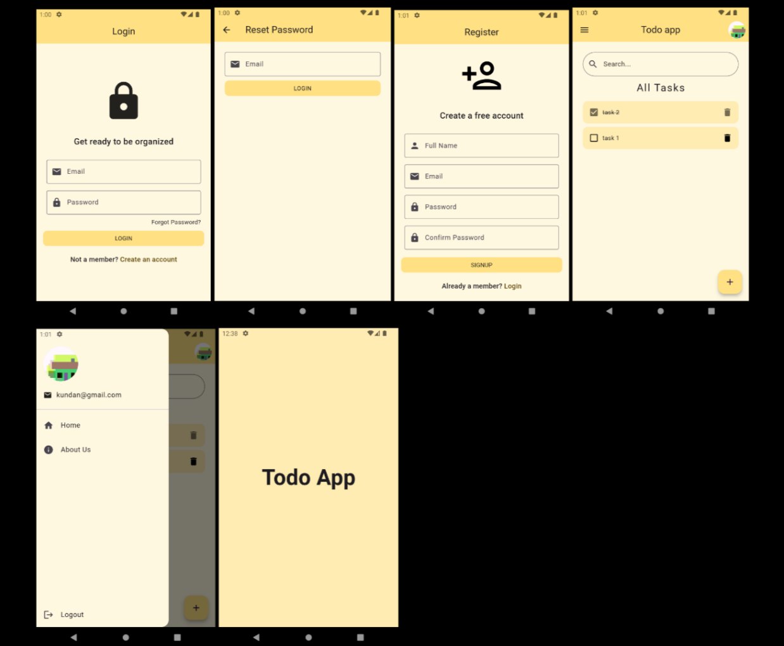

# Todo Application

## Tech Stack

- **Framework:** Flutter
- **Backend:** Firebase
- **Tools:** Dart, Firebase Authentication, Firestore Database, Firebase Storage, Image Picker

---

## Project Details

### Overview

This Todo Application is a user-friendly mobile application that allows users to manage their tasks efficiently. It is built using Flutter and Firebase. It provides a good experience for users to create, manage, and access their tasks across multiple devices.

### Features and Functionalities

1. **User Account Creation:**  
   Users can create an account to start using the application.

2. **User Login:**  
   Users can log in to their accounts securely.

3. **Separate User Accounts:**  
   Each user has their own account, ensuring that tasks are private and not visible to others.

4. **Search Functionality:**  
   Users can search for specific tasks easily within their task list.

5. **Logout Functionality:**  
   Users can log out of their accounts securely when needed.

6. **Profile Picture Upload:**  
   Users can upload a profile picture from their camera or gallery for personalization.

7. **Authentication:**  
   User authentication is implemented to ensure security and data integrity.

8. **Permanent Data Storage:**  
   User data is saved permanently and can be accessed from any device using the application.

9. **Task Deletion:**  
   Users can delete tasks they no longer need.

10. **Task Update:**  
    Users can update task titles to fix typing errors.

11. **Mark Task Status:**  
    Users can mark tasks as completed or incomplete, allowing for better task management.

---

### Conclusion

This simple Todo Application is built using the power of Flutter and Firebase to deliver a task management solution, enhancing productivity, ensuring user privacy and data security.
